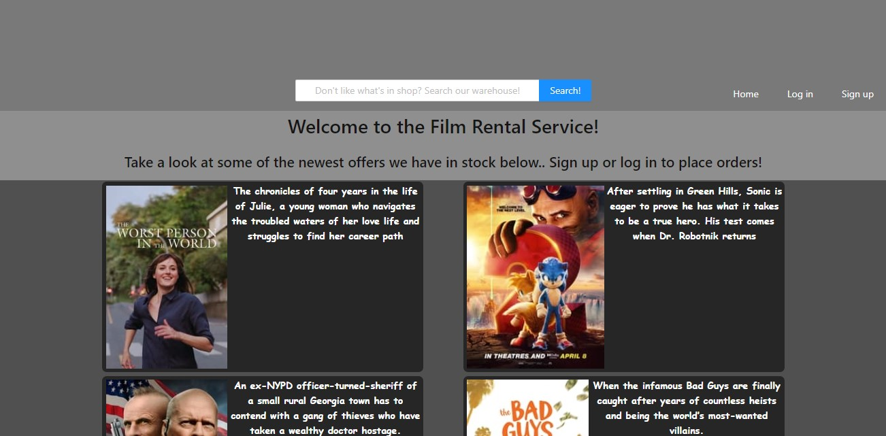
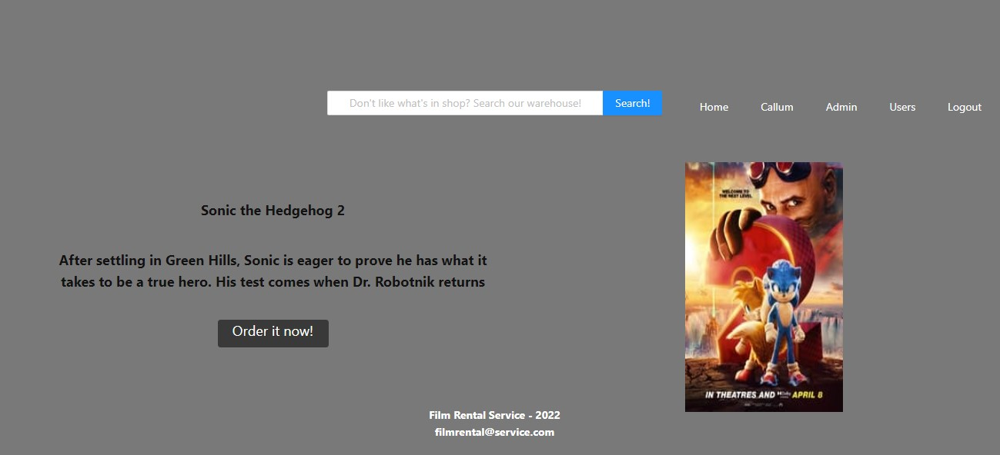
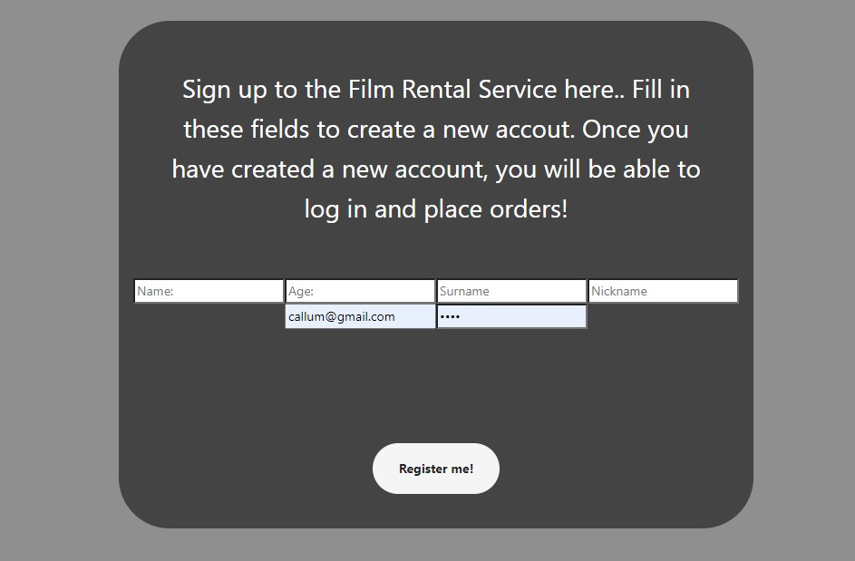
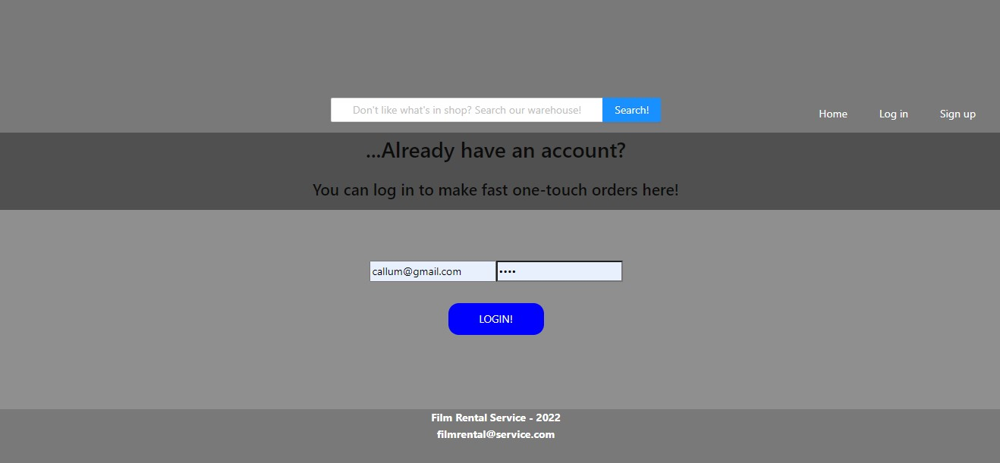

## Film Rental Front-End Project

A frontend project made with react in node.js. The purpose of this project was to create a fully interactive website for a movie rental company, which has a login, sign up, and admin section, as well as the ability to search for films in a back end database and then rent them,

***

## Made with React and Redux. 


***

Home page for the Film Rental Service
***

Placement of order page
***


The application has the following features:
* Users can log in to the application. They will then be able to use the extra functionality of the website to rent films. (Visitors who do not create an accout and log in have the ability to browse films but not place orders).
    * Users:
        * View their profile page which welcomes them to the site.
        * View the complete list of films in the warehouse using the search bar.
        * View the list of films available for rent in store on the homepage and place orders.
    * Admin:
        * Can see the complete list of users who have signed up to the service.
        * See a complete list of all the orders placed. Each order placed identifies the user by id, the film ordered by id, and the order itself by id.

***


..Sign up to create an account
***


..Log in to your account to place an order
***


## Pre-requisites of the project to run on your local computer:

* Install **Nodejs** on your computer, by downloading it from its official web page
https://nodejs.org/

* Clone the project on your computer with git bash:
```
$git clone 'url-from-repository'
```

* Install all dependencies with the following command:
```
npm install
```

* Start the server with the following command:
```
npm start
```
***

## Technologies used in the project:

* **react**: We install react in our project:
```
npm install react
```
* **react-router-dom**: We install react-router-dom in our project, so we can switch between views in our application:
```
npm install react-router-dom
```
* **axios**: We install axios in our project, to be able to query the API:
```
npm install axios
```
* ** **redux**: We install redux in our project, so we can use redux (state centralisation):
```
npm install redux
```
* **react-redux**: Install react-redux in our project (links react and redux):
```
npm install react-redux
```

***


## Explanation of the project structure

The **src** directory is where the whole application is stored. In this directory you will find the following:

* ** **index.js**: This is the main file. From here you call **<App/>**, which is where the whole application will be executed.

* **app.js**: This file is where the different **Containers** of the application (views) are managed.

***


* **Redux**: In this directory we store all the application's redux configuration.
    * **store.js**: This file contains the general state of the application.
    * **types.js**: This file contains the names of the types that we pass by action to the reducer.
    * **reducers**: This directory contains all the reducers that modify the state:
    * **index.js**: In this file we combine all the reducers, to achieve the desired centralisation of states with redux.
    * **datosLogin-reducer.js**: In this file we have the functions that edit the state of redux for the LOGIN, LOGOUT and UPDATE_DATA_LOGIN types.
    * **idFilMovieSearched-reducer.js**: This file contains the function that edits the redux status for the film searched. It saves in redux the the  that is clicked in the movie listing.

***


* **Containers**: This directory is where the different views will be stored:
    * **Admin**: In this view the admin user can see the list of orders placed by the customers and the list of customers who have created accounts.
    * **Login**: This view allows a user with a registered account to access their profile page and place orders.
    * **MovieDetail**: In this view you can select a film and read a brief synopsis of it. If you are logged in you can order it.
    * **Profile**: In this view you see your profile page which welcomes you by name to the service
    * **Register**: In this view you can sign up to the service by creating an account and registering your details in the database
    * **Home**: Home page. In this view you can browse a list of films taken from the API.
    * **SearchResults**: In this view you can see a list of films by name which are not in store but available from the warehouse (take from the moviedatabase api)


***

* **Components**: This directory is where all the components that will be used in all the views are stored:
    * **Rent**: This is the menu that appears when you try to rent a movie.
    * **Header**: A border which appears at the top at all times and presents the different links to various pages.
    * **Footer**: A section at the bottom which frames all of the pages.
    
    
