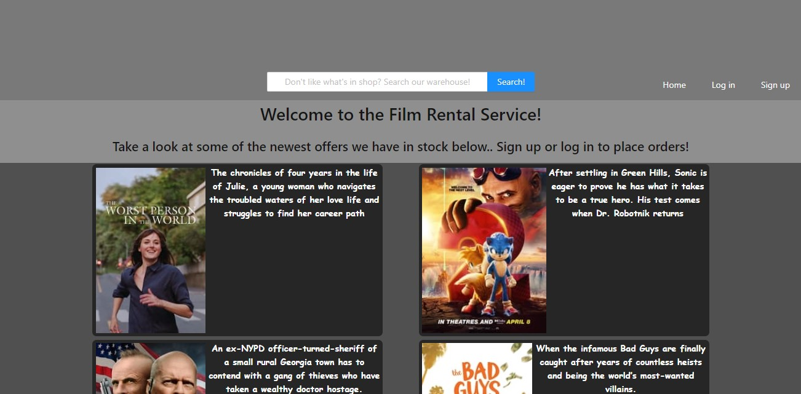
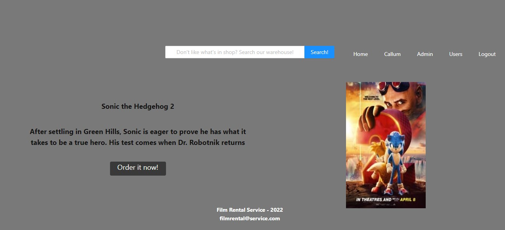
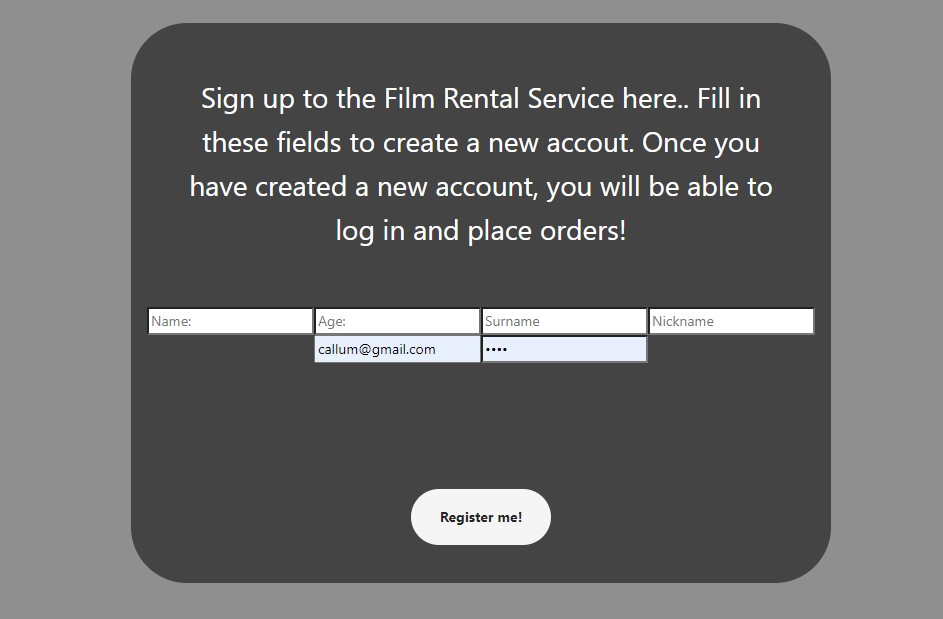
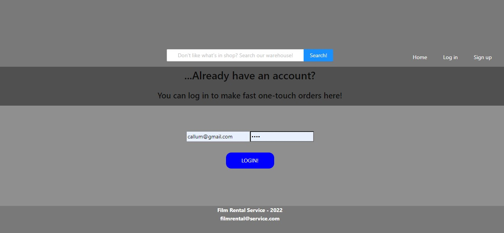

## Film-Rental-Service:

## Film Rental Front-End Project for GeeksHubs Academy.  https://github.com/callumgordon90/Proyecto-5-GeeksHubsAcademy/tree/main/film_rental

A front end project made with react in node.js. The purpose of this project was to create a fully interactive website for a movie rental company, which has a login, sign up, and admin section, as well as the ability to search for films in a back end database and then rent them,

***

## Made with React and Redux. Designed to connect with Api and Database from Project 4 (https://github.com/callumgordon90/Proyecto-4-GeeksHubsAcademy)


***

***

***


The application has the following features:
* Users can log in to the application. They will then be able to use the extra functionality of the website to rent films. (Visitors who do not create an accout and log in have the ability to browse films but not place orders).
    * Users:
        * View their profile page which welcomes them to the site.
        * View the complete list of films in the warehouse using the search bar.
        * View the list of films available for rent in store on the homepage and place orders.
    * Admin:
        * Can see the complete list of users who have signed up to the service.
        * See a complete list of all the orders placed. Each order placed identifies the user by id, the film ordered by id, and the order itself by id.

***


***


***


## Pre-requisites of the project to run on your local computer:

* Install **Nodejs** on your computer, by downloading it from its official web page
https://nodejs.org/

* Clone the project on your computer with git bash:
```
$git clone 'url-from-repository'
```

* Install all dependencies with the following command:
```
npm install
```

* Start the server with the following command:
```
npm start
```
***

## Technologies used in the project:

* **react**: We install react in our project:
```
npm install react
```
* **react-router-dom**: We install react-router-dom in our project, so we can switch between views in our application:
```
npm install react-router-dom
```
* **axios**: We install axios in our project, to be able to query the API:
```
npm install axios
```
* ** **redux**: We install redux in our project, so we can use redux (state centralisation):
```
npm install redux
```
* **react-redux**: Install react-redux in our project (links react and redux):
```
npm install react-redux
```

***


## Explanation of the project structure

The **src** directory is where the whole application is stored. In this directory you will find the following:

* ** **index.js**: This is the main file. From here you call **<App/>**, which is where the whole application will be executed.

* **app.js**: This file is where the different **Containers** of the application (views) are managed.

***


* **Redux**: In this directory we store all the application's redux configuration.
    * **store.js**: This file contains the general state of the application.
    * **types.js**: This file contains the names of the types that we pass by action to the reducer.
    * **reducers**: This directory contains all the reducers that modify the state:
    * **index.js**: In this file we combine all the reducers, to achieve the desired centralisation of states with redux.
    * **datosLogin-reducer.js**: In this file we have the functions that edit the state of redux for the LOGIN, LOGOUT and UPDATE_DATA_LOGIN types.
    * **idUserUserSearched-reducer.js**: In this file we have the functions that edit the redux state for the type SAVE_USER_ID_USER. It stores in redux the id of the user that is clicked in the user list.
    * **idFilMovieSearched-reducer.js**: This file contains the function that edits the redux status for the type SAVE_ID_MOVIE_ID. It saves in redux the id of the movie that is clicked in the movie listing.
    * **idOrderOrderSearched-reducer.js**: This file contains the function that edits the redux state for the type SAVE_ID_ORDER. It stores in redux the id of the order that is clicked in the order list.
    * **controlMessageRentalMessage-reducer.js**: This file contains the functions that edit the redux status for the types RENT_MESSAGE and RENT_MOVIE. Saves the movie to be rented, and saves whether or not to display the rent movie message.
    * **dataUpdateUser-reducer.js**: In this file we have the functions that edit the state of redux for the types COPY_DATA_LOGIN and SAVE_CHANGES_UPDATE.
    * **Movies_Showed-reducerr.js**: In this file we have the functions that edit the redux state for the type SAVE_MOVIES. It saves in redux the searched movie listing, and also the filtering done in the search bars.

***


* **Containers**: This directory is where the different views will be stored:
    * **Rentals**: In this view you can see the list of rentals of the logged in user.
    * **OrderSearch**: This view searches for an order by id, and shows the information of the order, the user who has placed the order and the rented movie.
    * **FindMovie**: In this view you search for a movie by id. In addition, you can edit the saved movie information and delete the movie.
    * **SearchUser**: In this view you search for a user by id. In addition, you can edit the saved user information and delete the user.
    * **Contact**: In this view you can contact the administrator by e-mail, by filling in either of the two available forms.
    * **Home**: In this view you can login, and access the contact view.
    * **OrderList**: In this view the orders placed are displayed, and you can access the search for these orders by clicking on any of them. You can also delete them by clicking on the corresponding button.
    * **Movies list**: In this view you can see the films of the video store, and you can access to the search of the films by clicking on any of them.
    * **Users list**: In this view, the users of the video club are displayed, and you can access to the search of the users by clicking on any of them.
    * **ErrorScreen**: This view shows the error screen that appears when trying to access areas of the application without being logged in.
    * **Movies**: This view shows all the list of movies in the application. You can filter by title, genre and main character. You can access the details of each film by clicking on it.
    * **FilmsAvailable**: This view shows all the unrented movies that are in the city of the logged in user.
    * **Profile**: This view shows the data of the logged in user. This data can be modified.
    * **MovieProfile**: This view shows all the data of the movie. If the film is not rented and is in the same city as the logged in user, the option to rent is available.
    * **MovieRegistration**: In this view you can create new movies.
    * **UserRegistration**: In this view you can create new users.
    * **YourZone**: This view shows an overview of what each user profile can do in the application.

***

* **Components**: This directory is where all the components that will be used in all the views are stored:
    * **Rent**: This is the menu that appears when you try to rent a movie.
    * **Header**: A border which appears at the top at all times and presents the different links to various pages.
    * **Footer**: A section at the bottom which frames all of the pages.
    
    